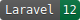

# Laravel Form Builder

Create one-thing-per-page forms broken down into tasks; ideal for the GOV.UK Design System!

## What's in the box?

* Laravel 12 Form Builder classes, interfaces, and traits
* Basic frontend pages for demonstration and testing purposes

The user interface is left up to you to implement and style as you desire.

## Installation

### Composer

You can install this library using Composer:

```bash
composer require anthonyedmonds/laravel-form-builder
```

### Service Provider

The Form Builder service provider will be automatically registered.

If you need to manually load it, you can add the following to your `config/app.php` file:

```php
'providers' => [
    // ...
    AnthonyEdmonds\LaravelFormBuilder\LaravelFormBuilderServiceProvider::class,
],
```

### Publish files

The following can be published using `php artisan vendor:publish`:

| Key    | Usage                                  | Target                            |
|--------|----------------------------------------|-----------------------------------|
| config | The Form Builder configuration file    | config/form-builder.php           |
| views  | The Form Builder blades and components | resources/vendor/form-builder/... |

The configuration file is required for registering forms.

The views are optional, used primarily as a basis for building your own form UI components. 

### Routes

Add the Form Builder routes to your `routes/web.php`:

```php
Route::laravelFormBuilder();
```

## Configuration

The `config/form-builder.php` file contains the following options:

| Key   | Usage                                   | Type                 | Default |
|-------|-----------------------------------------|----------------------|---------|
| forms | A list of Forms available in the system | class-string<Form>[] | []      |

## Structure

Each `Form` follows a simple structure, with movement controlled automatically based on the user's choices:

> Form > Start or Resume
> 
> Tasks > Task > Question
> 
> Summary > Submit or Draft > Confirmation > Exit

1. Upon entering a `Form`, the system will check whether they have an active session
   1. If they do, they will be asked whether they want to resume or start fresh
   2. If not, they will be shown a start page (if enabled)
2. Users will then be shown a list of `Tasks`
   1. They may pick any `Task` to complete, though a `Task` can be disabled if they cannot start it yet
3. Entering a `Task` shows the user the `Question` list
   1. Entering a `Question` allows the user to provide answers to any number of fields 
   2. Once all `Question` classes within a `Task` have been answered, they can return to the `Tasks` list
4. Once all `Task` classes have been completed, the user can then view a `Summary` of their answers
   1. They may then submit their answers, or save as a draft (if enabled)
5. After successful submission, users will be shown a confirmation screen (if enabled)
6. Users then exit the `Form`

This library provides all of the flow control basis required, based on the content you provide.

The user's answers are stored in a session directly on the related `Model` as they progress through the `Form`.

A [diagram is available here](./docs/UML%20v3.png) which shows the internal workings.

## Setting up a Form

Every Form starts by extending the `Form` class.

As a minimum, you will need to provide a unique `key()` for the Form, the `modelClass()`, and a set of `tasks()`.

You can customise the behaviour of your Form elements by overriding functions in your classes.

### Model

The `Model` to be used with your `Form` must implement the `UsesForm` interface.

The `HasForm` trait is provided to fill in most of the needed functionality.

As a minimum with the trait, you will need to provide a `viewRoute()`.

This will allow users to view their submission after completing the `Form`.

#### Drafts

A flag is provided on the `Model` to enable or disable saving as a draft.

If you enable saving as a draft, it is recommended to customise the `saveAsDraft()` function appropriately.

### Tasks

Every `Form` is broken up into several `Task` classes.

These are wrapped up in a `Tasks` class.

You can have as many or as few `Task` classes as you like; it is recommended to keep each `Task` to a minimum.

```php
public function tasks(): array
{
    return [
         MyTask::class,
         NextTask::class,
         ...
    ];
}
```

As a minimum, you will need to provide a list of `tasks()`.

#### Task Groups

You may group your tasks by providing a keyed array instead:

```php
public function tasks(): array
{
    return [
        'Group one' => [
            MyTask::class,
            ...
        ],
        'Group two' => [
            NextTask::class,
            ...
        ],
    ];
}
```

It is not recommended to mix grouped and ungrouped `Task` classes, as this may become visually confusing.

#### Showing and hiding Task classes

You can control which `Task` classes are shown by adding any needed logic to the `tasks()` method.

Users may be confused by the constant appearance and disappearance of tasks, so it is recommended to keep it simple, and consistent.

You may find it is better to have a `Task` in the `Not Required` state, instead of hiding it entirely.

### Start and Confirmation pages

Flags are provided on the `Form` to control whether to show the `Start` and `Confirmation` pages.

If `Start` is disabled, users will be taken straight to the `Tasks` page.

If `Confirmation` is disabled, users will be taken straight to the `viewRoute()` of the `Model`.

## Creating a Task

Each `Task` contains any number of `Question` classes.

As a minimum, you will need to provide a unique `key()`, and a list of `questions()`.

### Statuses

Every `Task` has a status based on the status each `Question`.

You can customise the logic of which statuses are shown by overriding the relevant functions on the `Task`.

For more information, see the `HasStates` trait.

### Showing and hiding Questions

You can control which `Question` classes are shown by adding any needed logic to the `questions()` method.

Users may be confused by the constant appearance and disappearance of questions, so it is recommended to keep it simple, and consistent.

You may find it is better to have a `Question` in the `Not Required` state, instead of hiding it entirely.

## Creating a Question

Each `Question` contains any number of fields, which should directly correspond to attributes on the `Model`.

A `Question` can be used in any number of `Task` classes, especially when abstracted if they are similar.

You can customise how values are read and written to the `Model`; by default, it will use the provided field key.

### Fields

Every `Question` has one or more `Fields`, which control the inputs shown on the page.

```php
[
    Field::input('name', 'What is their name?')
        ->setHint('Provide their full name')
        ->optional(),
]
```

`Field` comes with a helper for each common input type.

In this example, the first parameter is the `name` of the input, which corresponds to the `name` property on the `Model`.

The second parameter is the question being asked.

When there is only one `Field` in a `Question`, it should be used as the page title.

The `hint` method adds a line of supporting text to the `Field`.

The `optional` method marks the `Field` as not required; `Fields` are required by default.

Many other methods are available to further customise the input.

### Skippable Questions

A flag is provided to allow users to skip a question.

This can be useful for optional questions, where it may be clearer that the user does not have to give a response.

If you enable skipping, it is recommended to customise the `applySkip()` function appropriately.

### Looping Questions

A flag is provided to redirect users back to the same `Question` after saving.

This can be useful for adding multiple responses to the same question.

When doing this, the `Question` should also be skippable, with the skip option being used to progress forward.

If skipping is not enabled, the user will must be provided with a way to move forward.

### Statuses

Each `Question` has a status based on the user's answers to each field.

You can customise the logic of which statuses are shown by overriding the relevant functions on the `Question`.

For more information, see the `HasStates` trait.

## Using and accessing Forms

Users have two main entry points to any `Form`, new and edit.

### Start a new Form

Users can be redirected to the `new` endpoint using any of the following:

* `Model::formRoute()`
* `Model::newForm()->route()`
* `route('forms.new', MyForm::key())`

### Edit an existing Model

Users can be redirect to the `edit` endpoint using any of the following:

* `Model::formRoute($model->id)`
* `$model->form()->editRoute()`
* `route('forms.edit', [MyForm::key(), $model->id])`

## Viewing models

If you would like to use the Form Builder `Summary` page for a viewing a model, you may use the `view()` method on your model.

This will generate a `Summary` style page without the ability to change and answers.

A link back to the `Form` should be included, if the model can be edited.

You can control whether an individual `Question` can be edited by adjusting the `canChange()` method.

## Help and support

You are welcome to raise any issues or questions on GitHub.

If you wish to contribute to this library, raise an issue before submitting a forked pull request.

## Licence

Published under the MIT licence.
